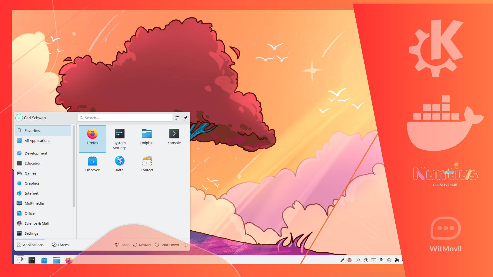

# KDE Plasma Desktop in Docker

This repository contains a Docker configuration to run **KDE Plasma Desktop** in a containerized environment. It provides access to the desktop environment via **VNC** and **noVNC**, making it easy to use graphical Linux applications without installing them natively on your system.



## 🛠 Features

- **KDE Plasma Desktop**: Full desktop environment for a modern graphical experience.
- **TigerVNC Server**: For secure remote desktop access.
- **noVNC**: HTML5-based VNC client to access the desktop from any web browser.
- **Persistent Volumes**: User configurations and desktop settings are preserved across sessions.
- **Support for ARM Architectures**: Includes optional installation of Pi-Apps for ARM-based systems.

---

## 🚀 Quick Start

### Prerequisites

1. Docker installed on your system.
2. Optional: Docker Compose (for multi-container setups).

### Build the Image

Clone this repository and build the Docker image:

```bash
git clone https://github.com/nuntius-dev/KDEPlasmaDesktopinDocker.git
cd KDEPlasmaDesktopinDocker
docker build -t kde-plasma-docker .
```

### Run the Container

To start the KDE Plasma Desktop:

```bash
docker run -d \
  -p 5901:5901 \
  -p 8080:8080 \
  -v $(pwd)/vnc:/root/.vnc \
  -v $(pwd)/desktop:/root/Desktop \
  --name kde-plasma-container kde-plasma-docker
```

### Access the Desktop

- **VNC Viewer**: Connect to `localhost:5901` using any VNC client. Use the password `docker` (modifiable in `Dockerfile`).
- **Browser (noVNC)**: Open [http://localhost:8080/vnc.html](http://localhost:8080/vnc.html).

---

## 🔧 Configuration

### Environment Variables

You can customize the setup using the following environment variables:

| Variable      | Default  | Description                           |
|---------------|----------|---------------------------------------|
| `DISPLAY`     | `:1`     | Display number for VNC server.       |
| `VNC_PORT`    | `5901`   | Port for the VNC server.             |
| `NOVNC_PORT`  | `8080`   | Port for noVNC.                      |
| `LANG`        | `en_US.UTF-8` | Language and locale settings.  |

### Persistent Volumes

- `/root/.vnc`: Stores VNC passwords and configurations.
- `/root/Desktop`: Preserves desktop files.

### Default User

The default user created is `nuntius`. You can modify this in the `Dockerfile` if needed.

---

## 🛡 Security Notes

- **VNC Password**: Default password is `docker`. It is strongly recommended to change it for production.
- **Firewall**: Ensure proper firewall rules to limit access to `5901` and `8080`.

---

## 🖥 For ARM Architectures

This image detects ARM-based systems (e.g., Raspberry Pi) and installs **Pi-Apps**, a suite of apps optimized for ARM devices. This step is optional and only runs on supported architectures.

---

## 📝 Development and Debugging

### Building the Image with Debugging Enabled

To enable additional logging or make changes during runtime:

```bash
docker build --build-arg DEBUG=true -t kde-plasma-debug .
```

### Accessing the Container

You can attach to the container for debugging:

```bash
docker exec -it kde-plasma-container bash
```

---

## 🌐 References

- [KDE Plasma](https://kde.org/plasma-desktop/)
- [TigerVNC](https://tigervnc.org/)
- [noVNC](https://novnc.com/)

---

## 👥 Contributing

We welcome contributions! Please follow these steps:

1. Fork the repository.
2. Create a feature branch: `git checkout -b feature-name`.
3. Commit changes: `git commit -m "Add feature-name"`.
4. Push to your branch: `git push origin feature-name`.
5. Submit a pull request.

---

## 📜 License

This project is licensed under the MIT License. See the [LICENSE](LICENSE) file for details.

---

[Buy me a coffee](https://ko-fi.com/P5P013UUGZ)
